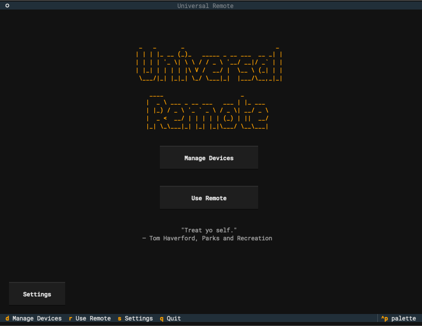
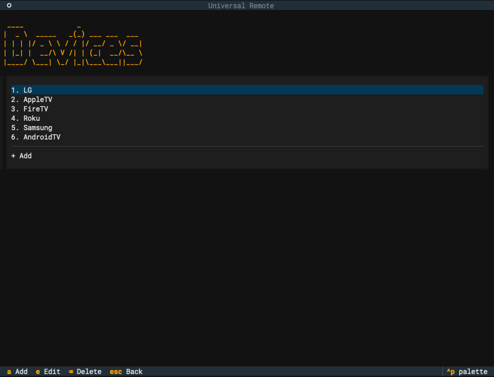
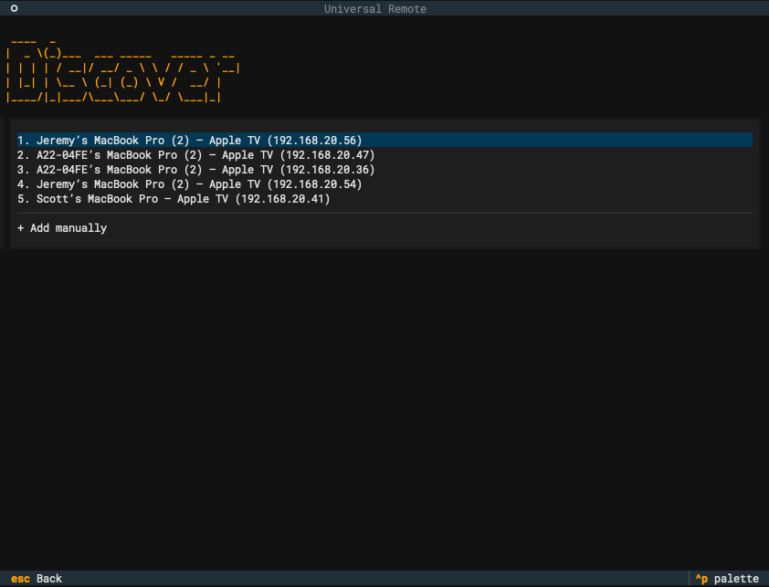
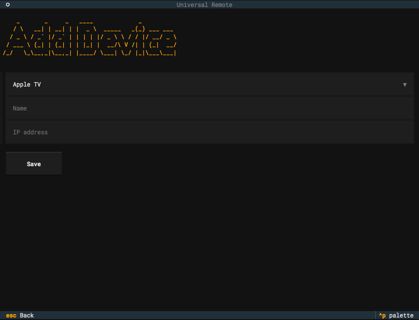
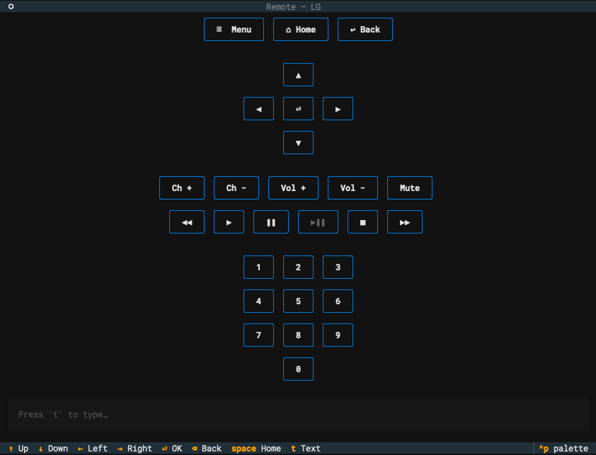
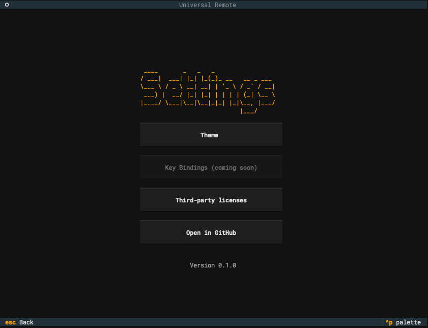
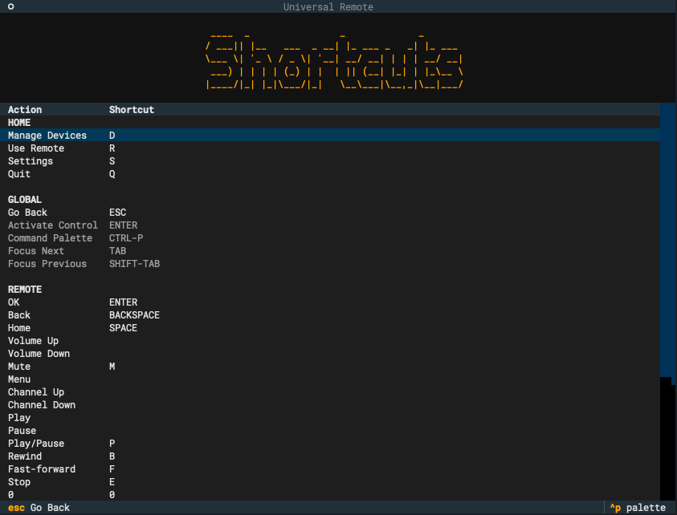
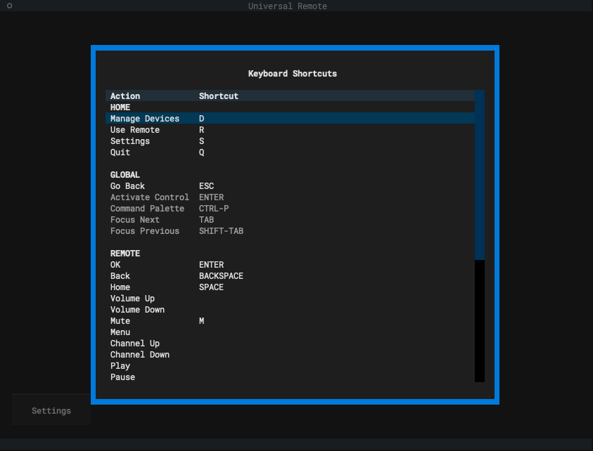

# universal-remote

A local, terminal-based universal TV remote — pretty, mouse-clickable, and fully
keyboard-drivable. It discovers TVs on your network, handles each platform's
pairing, and gives you a complete on-screen remote (d-pad, media transport,
number pad, volume, channel, on-demand text entry, and relabel-able custom
buttons) for **Samsung Tizen, LG WebOS,
Apple TV, Roku, Fire TV, and Android TV / Google TV** — all from one app.
Everything runs on your LAN; nothing leaves your network. The architecture is
platform-agnostic, so supporting a new TV platform is one new adapter module.

## Install

### Homebrew (macOS, Apple Silicon) — recommended

```sh
brew install praxder/tap/universal-remote
ur   # or the full name: universal-remote
```

Installs a self-contained binary — no Python or `uv` needed. The formula puts
both `ur` and `universal-remote` on your PATH; they're the same program. Apple
Silicon (arm64) only; an Intel Mac gets a clear architecture error rather than a
broken install.

### Download from GitHub Releases

Grab the latest `universal-remote-macos-arm64.tar.gz` from the
[Releases page](https://github.com/praxder/universal-remote/releases/latest).
The binary isn't notarized, so macOS quarantines a browser download — clear the
flag once after extracting:

```sh
tar -xzf universal-remote-macos-arm64.tar.gz
xattr -d com.apple.quarantine ./universal-remote   # clears the Gatekeeper block
./ur   # or ./universal-remote — a `ur` symlink ships beside the launcher
```

Apple Silicon macOS only, same as the Homebrew build.

### From source

Runs anywhere Python 3.13 does. Requires Python 3.13 (pinned via
`.python-version`) and [`uv`](https://docs.astral.sh/uv/):

```sh
uv sync
uv run ur   # or: uv run universal-remote
```

Development commands:

```sh
uv run pytest        # full suite; runs across all cores (add -n0 for a serial run)
uv run ruff format   # format
uv run ruff check    # lint
```

Tests need no real TV — adapters run against in-memory fakes and mocked
transport. To build the standalone binary yourself, run
`./packaging/build_binary.sh`. See [CONTRIBUTING.md](CONTRIBUTING.md) for the
commit and release conventions.

The Settings page links to [`THIRD_PARTY_LICENSES.md`](THIRD_PARTY_LICENSES.md),
generated from the locked runtime dependencies. Regenerate it when those
dependencies change (the file's header carries the exact commands).

## Features

Every screen is reachable by **mouse** (click anything) and by **keyboard**. The
app opens on a landing menu with two modes — **Manage Devices** and
**Use Remote** — a **Settings** page (`s`, or the bottom-left button), and a
footer that always shows the keys available on the current screen.



### Manage your devices

**Manage Devices** (`d`) lists your saved TVs, each numbered — press its number
(`1`–`9`) to open it, or use **Add** (`a`), **Edit** (`e`), and **Delete**
(`Backspace`).



### Add a TV — automatic discovery

**Add** (`a`) scans your local network and streams in the TVs it finds, each row
showing the device's **name**, its **platform**, and its **IP address** — rows
appear as each platform answers, so you don't wait for the whole scan. Select a
discovered TV to add it: no platform or IP typing, no pairing yet, and TVs you've
already saved are left out. Leave any time with `Esc`, even mid-scan.



Discovery is best-effort — a TV that's off, on another subnet, or not yet set up
(a Fire TV with ADB still disabled, say) simply won't appear.

### Add a TV — manual entry

If your TV isn't listed, **+ Add manually** (always the last row) opens a form:
pick the **platform**, enter a **name** and the TV's **IP address**, and **Save**.



### Pair and control

**Use Remote** (`r`) lists your devices, each with a **reachability bubble** —
🟢 on the network, 🔴 unreachable, 🟡 still checking (or unknown for a platform
with no probe port). It refreshes every few seconds and is advisory only; you can
still connect to a red device.

The first connection pairs the device, and the credential is saved so later
sessions connect straight through:

- **Samsung, LG, Fire TV** — accept the on-screen authorization popup.
- **Apple TV** — type the PIN it shows on the TV.
- **Android TV / Google TV** — type the pairing code it shows on the TV.
- **Roku** — no pairing at all; its control protocol is unauthenticated.

Then the remote appears. Drive it by mouse or keyboard:

| Key | Action |
| --- | --- |
| Arrows or `h` `j` `k` `l` | D-pad left/down/up/right |
| Enter | OK |
| Backspace | Back (sent to the TV) |
| Space | Home |
| `0`–`9` | Number-pad digits |
| `t` | Open the text-entry pop-up (type, Enter sends, Esc closes) |
| Esc | Go Back — leaves the remote (the app-wide back key) |



Menu, channel up/down, volume, mute, the media-transport keys (play, pause,
play/pause, rewind, fast-forward, stop), the number pad, and power are on-screen
buttons. Buttons the connected TV doesn't support are shown disabled — Apple TV
has no mute, Roku has no discrete play/pause/stop or number pad, Fire TV has no
channel keys, and so on.

Text entry is reached on demand: `t` opens a pop-up to type into rather than a
field parked at the bottom of the remote. A row of **five custom buttons** sits
there instead — click one to open its config pop-up and give it a title, saved
just for this device, for every device of its type, or globally. Reopen the
pop-up and it shows the scope the title is actually stored at, so you can see and
change where it applies — moving a button to a broader scope takes effect at
once. A **Reset** button clears the button back to its default title with no
action.

**Give a button an action.** In that same config pop-up, open **Action Type** and
pick **Run Custom Script** to attach a shell script to the button. Choose **Script
File** to point at a script on disk (it runs through the shell, so it needs no
shebang or `chmod +x`, and a leading `~` is expanded), or **Inline Script** to type
the script right there. A **Results** toggle decides what a run shows: **Don't Show** stays quiet on
success and only raises an error notification if the script fails, while **Show**
always opens a scrollable window with the exit code and the full output. A button's
title and action are stored together at the same scope. Once a button has an action,
**clicking it runs the script** instead of opening the config; to reconfigure it,
press **`e`** (shown as **Edit** in the bottom bar) to arm edit-mode and then activate
the button (by clicking it or pressing its shortcut) — that opens the config once,
after which edit-mode clears. Press **`e`** again to leave edit-mode without changing
anything. While edit-mode is armed the custom buttons highlight so you can tell it is
on. Reopening a configured button's action shows its saved source, script, and
Results settings filled in, so you pick up where you left off.
Scripts run in the background so the remote never freezes, bounded by a fixed
30-second timeout that kills a hung script. `REMOTE_IP` is set in the script's
environment to the connected device's IP address.

> **Trust model.** Run Custom Script executes shell **you** wrote, on **your own**
> machine, under your own account — there is **no sandbox** and no vetting of what a
> script does. `REMOTE_IP` is the only value the app injects into the environment,
> and the 30-second timeout is a reliability guard against a hung script, not a
> security control. Only attach scripts you understand and trust.

Every key above is a **default you can change**, and the on-screen-only buttons
(menu, channel, volume, mute, and the media-transport keys) can be **given** a
keyboard shortcut — see [Keyboard Shortcuts](#settings) in Settings. The five
custom buttons can be given shortcuts too (**Activate Custom Button 1**–**5**),
each firing the matching button exactly as a click would. The D-pad directions
(arrows and `h` `j` `k` `l`) are reserved for navigation and stay fixed.

### Settings

Open **Settings** from the menu with `s` or the bottom-left button. Every row is
reachable by mouse and by keyboard (arrows or `h` `j` `k` `l`), and `Esc`/`q`
returns to the menu:

- **Theme** — opens the built-in theme picker (the same one the command palette
  offers). The pick applies instantly and is **remembered across runs**, whether
  you change it here or from the palette.
- **Keyboard Shortcuts** — opens a screen listing every action and its shortcut,
  grouped under **Home / Global / Remote** headings. Press Enter on a row to open
  the capture modal, then press the key you want — **any key becomes the shortcut,
  Esc included**; the mouse-only **Delete** and **Cancel** buttons clear it or back
  out. Every shortcut is unique app-wide: a key already taken by another action, or
  a reserved key, is refused with a toast and nothing changes. Reserved keys — the
  D-pad, Enter, `Ctrl+P`, `Tab`/`Shift+Tab`, and `E` (the remote's edit-mode key
  for reconfiguring a custom button that has an action) — show as dimmed rows so you
  can see they're in use but fixed. Changes apply immediately and are **remembered
  across runs**.
- **Third-party licenses** — opens the generated
  [`THIRD_PARTY_LICENSES.md`](THIRD_PARTY_LICENSES.md) on GitHub in your browser.
- **Open in GitHub** — opens the project repository in your browser.
- **Version** — shows the installed app version (a non-interactive label).



The Keyboard Shortcuts screen itself:



### Keyboard tricks & other niceties

- **Vim-style navigation.** `h` `j` `k` `l` move through menus and lists
  everywhere alongside the arrow keys, and are the d-pad on the remote itself.
- **Number shortcuts.** In any device list, press a device's number (`1`–`9`) to
  jump straight to it.
- **Command palette.** `Ctrl+P` opens a fuzzy command palette (shown as
  `^p palette` in the footer) for everything the current screen offers — including
  a **Keyboard Shortcuts** entry that pops a read-only cheat sheet of every binding
  from any screen.

  
- **Customizable shortcuts.** Rebind the menu, remote, and Go Back keys — and
  assign the on-screen-only remote buttons a key — from **Settings → Keyboard
  Shortcuts**. Your choices are remembered across runs.
- **Settings page.** Press `s` on the menu (or click the bottom-left button) for
  theme, licenses, repo, and version — see [Settings](#settings) above.
- **Theme switching.** Change the whole app's color theme from Settings or the
  command palette (`Ctrl+P` → *Change theme*). Your choice is remembered across
  runs.
- **A movie quote on every launch.** The landing menu greets you with a random
  film/TV quote.
- **Stays up.** An unexpected error mid-session is caught, shown as a brief error
  toast, and the app keeps running rather than crashing to the terminal. The full
  traceback lands in `~/.config/universal-remote/error.log` for investigation.
- **Secrets stay local.** Devices and pairing credentials live in
  `~/.config/universal-remote/devices.json` (or `$XDG_CONFIG_HOME`), written
  owner-only (`0600`) since the file holds credentials. App preferences (the
  saved theme, custom keyboard shortcuts, and custom-button titles and actions)
  live beside it in `settings.json`, created on first change.

## Known limitations & future work

**Platform quirks**

- **Text entry is best-effort on every platform.** Samsung `SendInputString`, LG
  `insertText`, and ADB `input text` support all vary by app and firmware; a
  failed send reports "not supported" rather than silently dropping input.
- **Power-on is best-effort.** A TV that's off is woken with a Wake-on-LAN magic
  packet to its stored MAC, which requires the TV's "Wake on LAN / Network
  Standby" setting to be enabled (off by default on many sets). Power-**off** is
  reliable.
- **Missing keys by platform.** Apple TV has no mute (the Companion protocol
  lacks it); Roku exposes only a single play/pause toggle with no number pad or
  menu key; Fire TV has no channel keys (no tuner).
- **Fire TV needs ADB debugging** enabled on the TV before it can be controlled.
- **Android TV ADB text path** (an opt-in that fixes typing under the "use your
  phone's keyboard" overlay) needs the external `adb` binary and can't send
  non-ASCII characters.

**Distribution**

- **macOS Apple Silicon only.** The prebuilt binary is arm64 macOS; there are no
  Intel-Mac, Linux, or Windows builds yet. Running from source works anywhere
  Python 3.13 does, but only macOS is exercised.
- **The binary is unsigned and unnotarized**, hence the manual quarantine step
  for a Releases download (Homebrew installs are unaffected).

**Future work**

- More TV platforms — the architecture is one adapter module per platform.
- A signed + notarized binary, so the download path needs no `xattr` step.
- Linux, Windows, and Intel-Mac builds.
- More reliable text entry across firmware versions.
